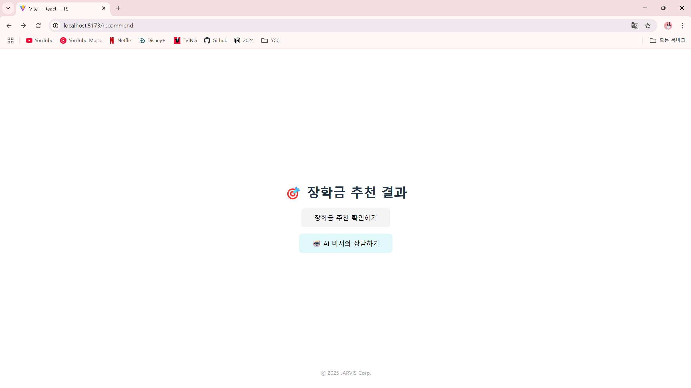

# 🎓 AI 지원금 분석 서비스

주민등록등본, 소득증명서, 재학증명서, 성적증명서를 업로드하면  
AI가 지원금 수혜 가능성을 분석하고 관련 제도를 추천해주는 서비스입니다.

## 🏗 프로젝트 개요

- **프로젝트명**: AGI-Hackaton
- **목적**: 문서 업로드 → Upstage API로 정보 추출 → AI 추천 시스템으로 최적의 정부지원금∙장학금 제도 제안

## 🧩 프로젝트 구조

```
AGI-Hackaton
├── backend
│   ├── main.py
│   ├── database.py
│   ├── domain
│   │   ├── student
│   │   └── scholarship
│   ├── llm_router.py
│   ├── llm_model.py
│   └── ...
├── frontend
│   └── ...
```

## ⚙ 주요 기능

### 📑 문서 업로드 및 분석
- 주민등록등본, 소득증명서 → 사용자 일반 정보 추출 (이름, 나이, 소득 등) (구현 예정)
- 재학증명서, 성적증명서 → 학생 학적∙성적 정보 추출

### 🤖 Upstage API
- **Document Parsing**: PDF 텍스트 추출
- **InfoExtract**: 문서에서 기준이 되는 정보(소득, 전공, 성적 등) 구조화
- `langchain_upstage` + `solar-pro` 모델을 사용하여 한국어 문서 처리를 고도화

### 🌐 AI 기반 제도 추천
- 학습된 AI 모델(`langchain_upstage`, `HuggingFaceEmbeddings`, etc.)로 사용자 정보와 문서 정보를 종합 분석
- 개인별/맞춤형 제도(장학금, 정부지원금) 추천

## 🔑 기술 스택

- **Backend**: FastAPI, SQLAlchemy, SQLite (비동기 엔진)
- **AI Model**: LangChain, HuggingFace, Upstage
- **Frontend**: React (TypeScript)
- **Infra / DevOps**: uvicorn, pip, GitHub

## 🚀 실행 방법

```bash
cd backend
python -m venv venv
.\venv\Scripts\activate  # Mac/Linux: source venv/bin/activate
pip install -r requirements.txt
uvicorn main:app --reload
```

## 📦 사용 예시

1. **학생 사용자**  
   - `/upload/student` 라우터를 통해 재학증명서, 성적증명서 업로드 → DB 저장  
   - `/recommend/recommend-programs` 라우터로 AI 추천 결과 받기  

2. **추가 입력 기반 결과**  
   - `/recommend/final-result` 라우터를 통해 세션 정보, 추천 프로그램, 추가 질의 모두 종합해 최종 답변 수령  

## 🧭 API 엔드포인트

- `POST /create-session` : UUID 기반 세션 생성
- `POST /upload/scholarship` : 장학금 서류 업로드 → DB 저장
- `GET /recommend/recommend-programs` : 사용자 정보 기반 장학금/지원금 추천
- `POST /recommend/final-result` : 추가 질문/정보 입력 후 최종 결과 반환

## 📸 예시 화면


## 🤝 기여 방법
1. 포크(Fork) → 새로운 브랜치 생성 → 기능 구현  
2. PR(Pull Request)을 통해 변경 사항 제안  
3. 코드 리뷰 후 머지(Merge)